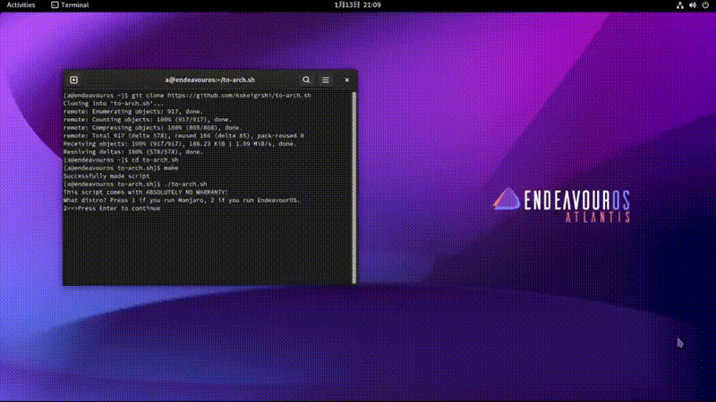

# to-arch.sh — Arch derivatives become Arch
## How to use
Go to the <a href="https://github.com/kskeigrshi/to-arch.sh/releases/latest">Releases tab</a>.
 Download <code>to-arch.sh</code> by clicking on it.
Run
<code>
bash to-arch.sh</code>.

## Please be goddamn sure that I have no responsibility for a non bootable system or a wiped out /home(it's a Bash bug, not my fault). It's your choice to run something like this, right?
 
### This converts your Manjaro or EndeavourOS installation into Arch Linux while preserving the userland and packages. 
By the way, the makefile of this script assumes that you use GNU coreutils. If you're a pervert who uses something like BSD coreutils on Linux, please tell me, as I'll ignore you.

## Showcase

## Why did I write this?

### Похуй, why not, my friend?

<h2></h2>

<samp>
Maybe you have some bird ideas.

Maybe that's the best thing you can do.

 — Terry. A. Davis
</samp>

